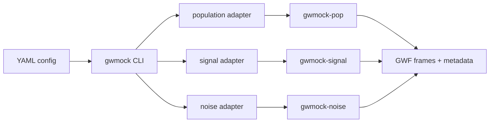

# Package Walkthrough

This page is a guided, top-level tour of `gwmock`: a quick path to generating
data, and an orientation for anyone who wants to understand how the package is
put together before inspecting the source code. It answers three questions:

1. [How do I use it?](#how-do-i-use-it) — the shortest path from installation to
   a dataset.
2. [How is it designed?](#how-is-it-designed) — the architecture in one picture,
   with pointers into the source tree. See the [Design Walkthrough](design.md)
   for the full tour.
3. [How is it maintained?](#how-is-it-maintained) — the testing, dependency, and
   release policies that keep the package healthy. See
   [Maintenance & Quality](maintenance.md) for details.

If you prefer to learn from a live session, past workshop slides and hands-on
materials are collected on the [Workshops](../workshops.md) page.

## How do I use it?

`gwmock` is driven by a single CLI and YAML configuration files. A complete
first run looks like this:

```bash
# 1. Install (Python 3.12–3.14)
uv venv --python 3.13 && source .venv/bin/activate
uv pip install gwmock

# 2. Fetch a ready-made quick-start configuration
gwmock config --get noise/uncorrelated_gaussian/quick_start --output quick_start_config.yaml

# 3. Generate the dataset
gwmock simulate quick_start_config.yaml

# 4. Verify the output against its recorded checksums
gwmock validate output/ metadata/
```

This produces GWF frame files with simulated noise and injected CBC signals for
the triangular ET configuration, plus a `.metadata.json` provenance record
containing the resolved configuration, seeds, package versions, and SHA-256
hashes of every output file. That metadata file can be fed back to
`gwmock simulate` to reproduce the run bit-for-bit. (One caveat, in
[Reproducibility](reproducibility.md): Earth-orientation data is not pinned by a
package version, so a run reproduced long after it was made can differ in
sidereal time.)

The main CLI commands:

| Command             | Purpose                                                            |
| ------------------- | ------------------------------------------------------------------ |
| `gwmock simulate`   | Run a simulation from a YAML config or a metadata file             |
| `gwmock config`     | Fetch built-in example configs, or edit configs interactively      |
| `gwmock validate`   | Check output files against the SHA-256 hashes recorded in metadata |
| `gwmock merge`      | Merge outputs from split runs                                      |
| `gwmock batch`      | Prepare and submit cluster jobs (Slurm or HTCondor)                |
| `gwmock repository` | Publish and manage datasets on Zenodo                              |

Where to go next as a user:

- [Installation](installation.md) and [Quick Start](quickstart.md) — the
  detailed version of the steps above.
- [Generating Data](generating-data.md) — ET-focused recipes.
- [Configuration Files](configuration.md) — the full configuration schema.
- [Examples](examples.md) — the catalog of ready-to-use configurations.

## How is it designed?

The single most important design decision: **`gwmock` is an orchestration layer,
not a physics library.** All physics lives in three split-out packages with
stable public protocols, and `gwmock` coordinates them:



- **[gwmock-pop](https://github.com/Leuven-Gravity-Institute/gwmock-pop)** —
  source populations (which events to inject).
- **[gwmock-signal](https://github.com/Leuven-Gravity-Institute/gwmock-signal)**
  — waveform generation and detector projection.
- **[gwmock-noise](https://github.com/Leuven-Gravity-Institute/gwmock-noise)** —
  colored/correlated noise, spectral lines, glitches.

Each is consumed through a **protocol contract**
([Protocol Contracts](protocols.md)): any third-party class that satisfies the
protocol can be plugged in from the YAML config without changing `gwmock`
([Extensibility](extensibility.md)). What `gwmock` itself adds is configuration
management, deterministic seeding, checkpoint/resume, provenance metadata, and
output validation.

### Source map

The main packages, in a sensible reading order:

| Package / module                                                                                                                                                             | What it does                                                                                                                                      |
| ---------------------------------------------------------------------------------------------------------------------------------------------------------------------------- | ------------------------------------------------------------------------------------------------------------------------------------------------- |
| [`gwmock.cli`](../reference/gwmock/cli/index.md)                                                                                                                             | Entry point (`cli/main.py`), the `simulate` command, config loading/resolution/templating, backend resolution, checkpointing, the simulation plan |
| [`gwmock.population`](../reference/gwmock/population/index.md), [`gwmock.signal`](../reference/gwmock/signal/index.md), [`gwmock.noise`](../reference/gwmock/noise/index.md) | Thin adapters that translate orchestration config into the public protocols — no physics here                                                     |
| [`gwmock.simulator`](../reference/gwmock/simulator/index.md)                                                                                                                 | Base simulator, state tracking for checkpoint/resume, deterministic seed derivation                                                               |
| [`gwmock.data`](../reference/gwmock/data/index.md)                                                                                                                           | Time-series containers, signal injection, serialization                                                                                           |
| [`gwmock.utils`](../reference/gwmock/utils/index.md)                                                                                                                         | I/O, logging, random-state management, ET detector geometries                                                                                     |
| [`gwmock.repository`](../reference/gwmock/repository/index.md)                                                                                                               | Zenodo publishing                                                                                                                                 |
| [`gwmock.monitor`](../reference/gwmock/monitor/index.md)                                                                                                                     | Resource-usage monitoring                                                                                                                         |

The [Design Walkthrough](design.md) expands on this: the data flow of a
simulation, the reproducibility machinery, and the reasoning behind the
adapter/protocol split.

## How is it maintained?

Summarized here; full detail on [Maintenance & Quality](maintenance.md).

- **Unit tests & CI** — the pytest suite runs on every pull request across Linux
  and macOS and Python 3.12–3.14, with coverage tracked on Codecov. A dedicated
  CI job installs the _oldest_ supported version of every dependency to prove
  the declared minimums actually work.
- **SPEC 0 dependency policy** — supported versions of Python and scientific
  dependencies follow the
  [Scientific Python SPEC 0](https://scientific-python.org/specs/spec-0000/)
  support window. A monthly automated workflow raises the version floors in
  `pyproject.toml` accordingly.
- **Renovate** — all other dependency maintenance (patch/minor updates, lock
  file refreshes, GitHub Actions, pre-commit hooks) is automated with
  [Renovate](https://docs.renovatebot.com/), with CI gating every automated
  merge. Major updates always require human review.
- **Scheduled releases** — releases are cut automatically every Tuesday at 00:00
  UTC when there are new commits, with changelogs generated from the
  conventional-commit history on the
  [GitHub Releases page](https://github.com/Leuven-Gravity-Institute/gwmock/releases).
  Every release is published to [PyPI](https://pypi.org/project/gwmock/) and
  archived with a DOI on [Zenodo](https://doi.org/10.5281/zenodo.17925458).
